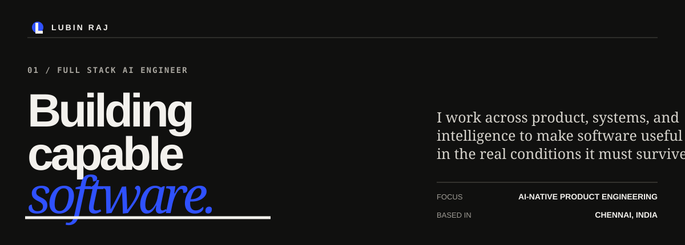
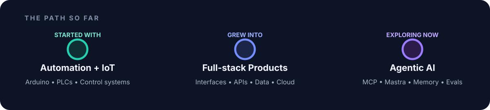
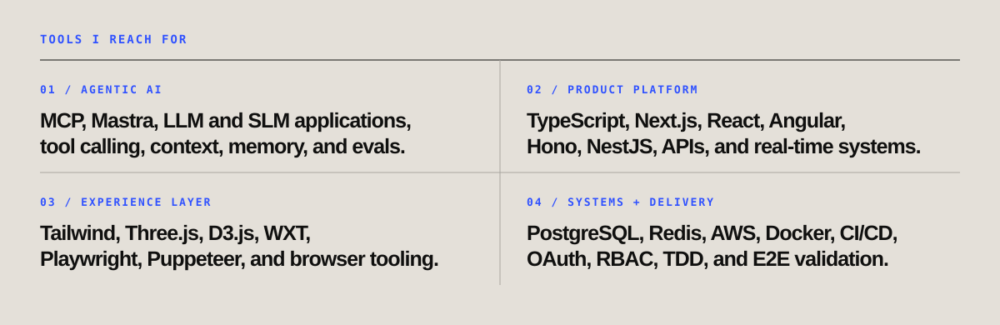

  

  <a href="https://www.linkedin.com/in/lubinrajJ/">LinkedIn</a> •
  <a href="https://github.com/LubinRaj/Cognaxis">Cognaxis</a>

## A quick hello

I'm a **Full Stack AI Engineer** who enjoys projects where interfaces, APIs, data, cloud, and AI have to work together.

I started with industrial automation and IoT, moved into full-stack product engineering, and now spend most of my curiosity on agentic systems. I am still early in my career, so I actively look for difficult projects that force me to learn beyond what I already know.

  

## What I'm exploring

| 🧠 Reliable agents | 🧩 Context and memory |
| --- | --- |
| Tool contracts, permissions, recovery, observability, and human approval | Long-running context, retrieval, memory boundaries, deletion, and evaluation |
| 🤝 Multi-agent systems | 🏭 Agentic SDLC |
| When agents should collaborate and when deterministic software is the better choice | Using agents across planning, TDD, implementation, browser validation, review, and release |

## Current build - [Cognaxis](https://github.com/LubinRaj/Cognaxis)

> Cognaxis began during the Google GenAI Academy program. I chose an AI-assisted journal because memory makes trust unavoidable: who owns the context, what can the model see, and what must disappear when something is deleted?

Today it is my playground for Gemini, permission-scoped memory, tenant boundaries, signal tracking, insights, server-side model access, and security-focused testing. It is an active build, not a finished showcase.

  

## Highlights

| 🎓 Google GenAI Academy | 🥇 IIT Madras NPTEL |
| --- | --- |
| **GenAI Master, 2026** Built Cognaxis with Gemini, Google AI Studio, and Cloud Run | **Operations Management specialization** Top 1% in one subject and Top 10% in two subjects |
| 🚀 IET-NASA Space Apps | 📄 Published research |
| **People's Choice / 3rd Prize, 2020** Led a six-member unmanned rover project | **ICTAME and IRJET, 2021** Hydraulics-based automatic urinal flushing system |

## What I want to build next

Ambitious AI products with multiple tools, meaningful data, long-running context, complex workflows, and enough scale to reveal the hard engineering problems.

I want this profile to grow into a visual record of that journey: working projects, experiments, reusable patterns, and lessons that only appear after building something real.

  <strong>Building a serious AI product, agent platform, or difficult full-stack system?</strong> 
  <a href="https://www.linkedin.com/in/lubinrajJ/">Let's connect on LinkedIn</a>

